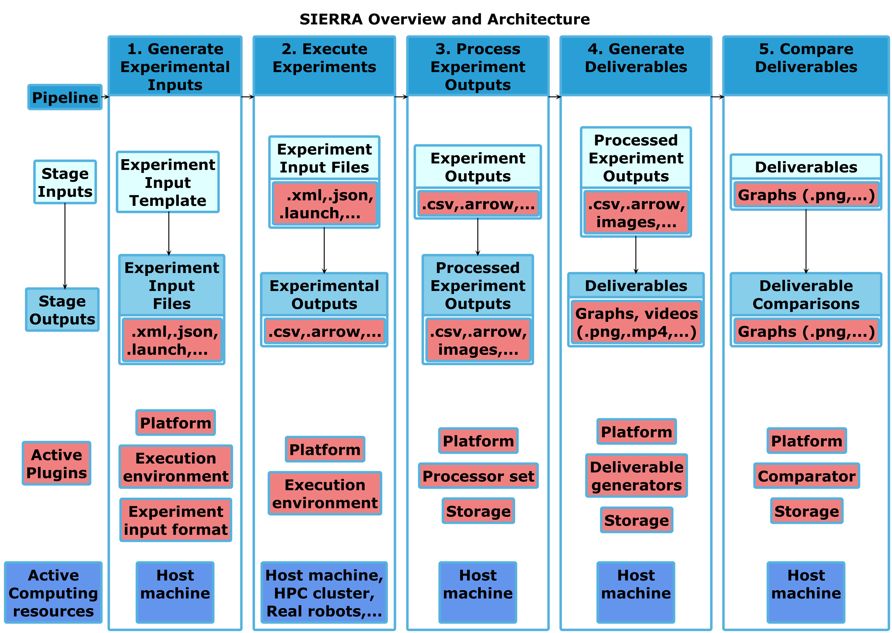

.. SIERRA documentation master file, created by
   sphinx-quickstart on Sat Oct 12 17:39:54 2019.
   You can adapt this file completely to your liking, but it should at least
   contain the root `toctree` directive.

===========================================================================
SIERRA (reSearch pIpEline for Reproducibility, Reusability, and Automation)
===========================================================================

   SIERRA architecture, organized by pipeline stage. Stages are listed left to
   right, and an approximate joint architectural/functional stack is top to
   bottom for each stage. “...” indicates areas where SIERRA is designed via
   plugins to be easily extensible. “Host machine” indicates the machine SIERRA
   was invoked on.

.. include:: src/description.rst

.. toctree::
   :hidden:
   :caption: Contents:

   src/trial.rst
   src/getting_started.rst

   src/requirements.rst
   src/matrix.rst

   src/usage/examples.rst
   src/usage/index.rst

   src/tutorials/index.rst
   src/plugins/index.rst
   src/packages.rst

   src/philosophy.rst
   src/faq.rst
   src/contributing.rst
   src/roadmap.rst
   src/glossary.rst
   src/api.rst

Citing SIERRA
=============

If you use SIERRA and find it helpful, please cite the following paper::

  @inproceedings{Harwell2022a-SIERRA,
   author = {Harwell, John and Lowmanstone, London and Gini, Maria},
   title = {SIERRA: A Modular Framework for Research Automation},
   year = {2022},
   isbn = {9781450392136},
   publisher = {International Foundation for Autonomous Agents and Multiagent Systems},
   address = {Richland, SC},
   booktitle = {Proceedings of the 21st International Conference on Autonomous Agents and Multiagent Systems},
   pages = {1905–1907},
   numpages = {3},
   keywords = {simulation, real robots, research automation, scientific method},
   location = {Virtual Event, New Zealand},
   series = {AAMAS '22}
   }

You can also cite the following DOI for the specific version of SIERRA used, to
help facilitate reproducibility:

.. |doi| image:: https://zenodo.org/badge/125774567.svg
         :target: https://zenodo.org/badge/latestdoi/125774567

|doi|

SIERRA In The Wild
==================

Here is a non-exhaustive list of some of the different ways SIERRA has been
used.

Papers
------

- :xref:`Harwell2021a-metrics`
- :xref:`Harwell2022b-ode`
- :xref:`Harwell2020a-demystify`
- :xref:`Harwell2019a-metrics`
- :xref:`White2019-social`
- :xref:`Chen2019-battery`

Projects
--------

- :xref:`FORDYCA`
- :xref:`PRISM`

Demos
-----

- :xref:`2022-aamas-demo`
