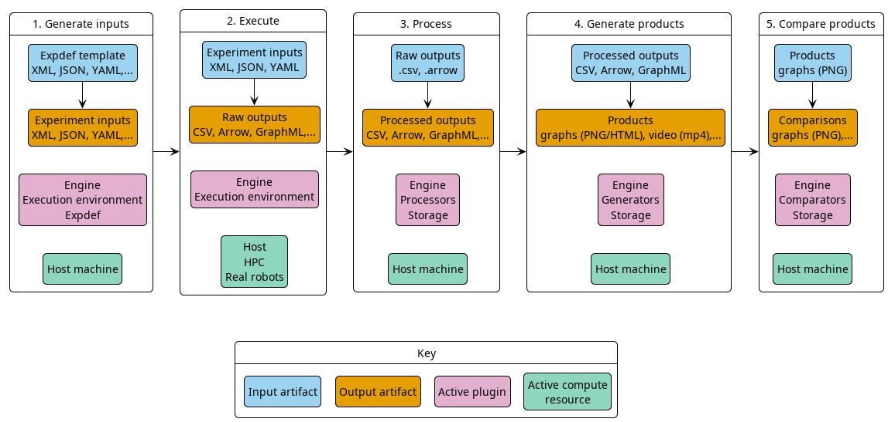

.. _main:

SIERRA (reSearch pIpEline for Reproducibility, Reusability, and Automation) is
a command-line framework for running **large-scale, reproducible computational
experiments**.  It automates the full experimental workflow: generating
experiment inputs, executing experiments across heterogeneous computing
environments, collecting results, processing data, and producing analysis
artifacts such as plots, videos, and comparative summaries.

SIERRA emphasizes **reproducibility**, **automation**, and **reuse**, allowing
researchers to focus on experimental design rather than infrastructure,
scripts, and environment management.

Typical use cases include robotics simulation studies, ML hyperparameter
sweeps, large parameter studies in scientific computing, and automated
benchmarking pipelines.

Quick Paths
===========

.. grid:: 5
   :gutter: 2

   .. grid-item-card:: 🚀 Run an Experiment
      :link: getting-started/trial
      :link-type: ref
      :class-card: sd-border-1

      Try SIERRA immediately using the built-in sample project.

   .. grid-item-card:: 💡 Understand the Model
      :link: concepts/overview
      :link-type: ref
      :class-card: sd-border-1

      Learn how experiments, batch criteria, the pipeline, dataflow, and the
      runtime tree work together.

   .. grid-item-card:: 🔧 Configure Your Project
      :link: tutorials/project/project
      :link-type: ref
      :class-card: sd-border-1

      Integrate your codebase and experiment definitions with SIERRA.
   .. grid-item-card:: 📐 Grok the Architecture
      :link: arch/plugin-system
      :link-type: ref
      :class-card: sd-border-1

      The execution model, plugin system internals, and deep-dive
      design notes.

   .. grid-item-card:: 🔌 Extend SIERRA
      :link: tutorials/plugins
      :link-type: ref
      :class-card: sd-border-1

      Add new engines, storage formats, processors, and analysis tools.

.. TIP:: If the :term:`Engine` you are targeting is already built into SIERRA
         (see :ref:`here <plugins/engine>` for list), integrating your codebase
         with SIERRA should be very quick.

System Overview
===============

SIERRA organizes experimentation as a **five-stage pipeline** that transforms
an experiment template into comparable, reproducible results — generating
inputs, executing runs, post-processing outputs, producing graphs and videos,
and optionally comparing across configurations. Every stage is driven by
interchangeable plugins, so the same pipeline works across simulators, HPC
clusters, and physical robots.

   SIERRA architecture organized by pipeline stage (left to right). Each stage
   consumes artifacts produced by the previous stage and generates new artifacts
   that advance the experiment toward final results and comparisons.

For a full explanation of how the pipeline, experimental design, runtime tree,
and dataflow model fit together, see :ref:`concepts/overview`.

SIERRA In The Wild
==================

SIERRA has been used across a range of published research in swarm robotics,
multi-robot systems, and ODE-based modeling — demonstrating its flexibility
across simulation platforms, scale, and experimental designs.

Papers
------

**Swarm Robotics & Collective Behaviour**

- :xref:`Harwell2021a-metrics`
- :xref:`Harwell2020a-demystify`
- :xref:`Harwell2019a-metrics`
- :xref:`White2019-social`

**Modelling & Task Allocation**

- :xref:`Harwell2022b-ode`
- :xref:`Chen2019-battery`

Demos
-----

- :xref:`2022-aamas-demo`

.. note::

   Using SIERRA in your research? See :ref:`reference/citing` for BibTeX
   entries and version-specific DOI badges for reproducibility.

.. toctree::
   :hidden:
   :maxdepth: 2

   src/getting-started/index
   src/concepts/index
   src/user-guide/index
   src/tutorials/project/index
   src/tutorials/plugins/index
   src/plugins/index
   src/architecture/index
   src/reference/index
