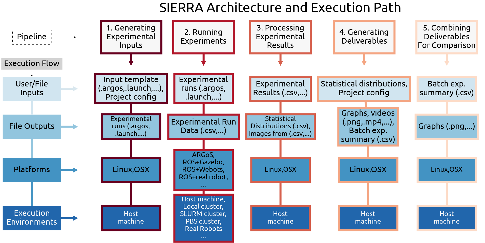

.. SIERRA documentation master file, created by
   sphinx-quickstart on Sat Oct 12 17:39:54 2019.
   You can adapt this file completely to your liking, but it should at least
   contain the root `toctree` directive.

=====================================================================
SIERRA: Automation for the Scientific Method and Agent-Based Research
=====================================================================

   Architecture of SIERRA, organized by pipeline stage. Pipeline stages are
   listed left to right, and an approximate joint architectural/functional stack
   is top to bottom for each stage. “... ” indicates areas where SIERRA is
   designed via python plugins to be easily extensible. “Host machine” indicates
   the machine SIERRA was invoked on.

.. include:: src/description.rst

.. toctree::
   :maxdepth: 1
   :hidden:
   :caption: Contents:

   src/getting_started.rst
   src/trial.rst

   src/packages.rst
   src/platform/index.rst
   src/requirements.rst

   src/tutorials/index.rst
   src/usage/index.rst

   src/exec_env/index.rst

   src/storage/index.rst

   src/philosophy.rst
   src/faq.rst
   src/contributing.rst
   src/glossary.rst
   src/api.rst

Citing SIERRA
=============

If you use SIERRA and find it helpful, please cite the following paper::

  @inproceedings{Harwell2022a-SIERRA,
  author = {Harwell, John and Lowmanstone, London and Gini, Maria},
  title = {SIERRA: A Modular Framework for Research Automation},
  year = {2022},
  isbn = {9781450392136},
  publisher = {International Foundation for Autonomous Agents and Multiagent Systems},
  booktitle = {Proceedings of the 21st International Conference on Autonomous Agents and Multiagent Systems},
  pages = {1905–1907}
  }

SIERRA In The Wild
==================

Here is a non-exhaustive list of some of the different ways SIERRA has been
used.

Papers using SIERRA
-------------------

- :xref:`Harwell2021a-metrics`
- :xref:`Harwell2022a-ode`
- :xref:`Harwell2020a-demystify`
- :xref:`Harwell2019a-metrics`
- :xref:`White2019-social`
- :xref:`Chen2019-battery`

Projects Using SIERRA
---------------------

- :xref:`FORDYCA`
- :xref:`PRISM`

Demonstrations using SIERRA
---------------------------

- :xref:`2022-aamas-demo`
